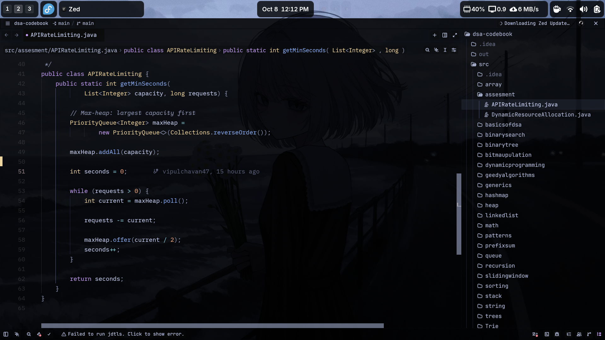

# 🔧 Dotfiles (Fedora)

My personal Fedora + GNOME setup — clean, minimal, and blazingly fast.

## ⚙️ Setup

| | |
|---|---|
| 🐧 **OS** | Fedora Workstation |
| 🎨 **Desktop** | GNOME |
| 🖥️ **Terminal** | Ghostty |
| 📝 **Shell** | Bash / Zsh |
| ⚡ **Prompt** | Powerlevel10k |
| 🚀 **Launcher** | Vicinae |
| 📊 **Fetch** | Fastfetch |

## 🧩 GNOME Extensions

- ArcMenu
- Blur My Shell
- Caffeine
- Clipboard Indicator
- Just Perfection
- Media Controls
- Modern Clock
- Tasks in Panel
- Tiling Shell
- Vitals
- User Themes

## 📸 In Action

**Desktop**


**CAVA**


**GNOME Overview**


**Terminal & Fastfetch**


**Vicinae Launcher**


**Zed Editor**


**Obsidian & VSCode**


**Pokeshell**


## 📂 What's Inside

```
.config/          → App configs
gnome/            → GNOME tweaks
Obsidian Config/  → Custom CSS
extensions.txt    → Extension list
.p10k.zsh         → Powerlevel10k magic
```

---

⭐ **If you dig this setup, drop a star!** Always evolving as my workflow changes.
